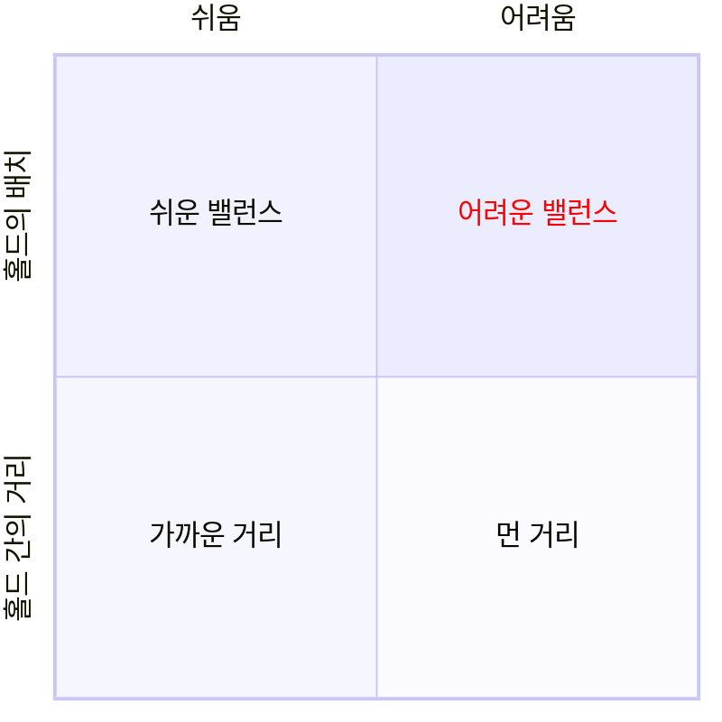
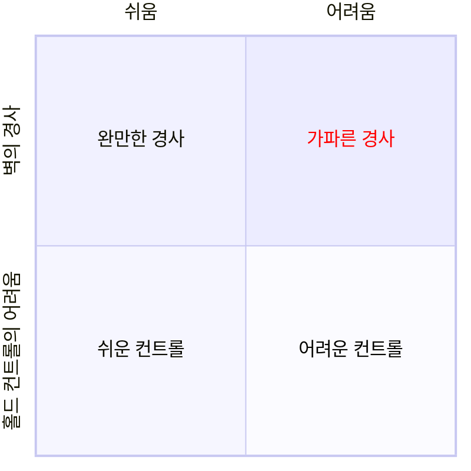

**실력 향상을 위한 노력은 ==클라이머에게 숙명==**
# 난이도를 결정하는 네 가지 요소
___
> **핵심은 무브로 귀결**

클라이밍은 움직이지 않는 대상에 몸을 맞추어 가는 것이다. 
다른 스포츠와 달리 대상을 유리하게 움직이게 하는 것이 불가능하다.

# 실력 향상을 위한 과제: 약점 줄이기
___
> 루트 등반 시 떨어지는 원인은 자신의 부족한 능력 때문이다.

클라이밍 루트에서는 홀드의 간격, 크기, 배치 등이 모두 다르며 이동할 때마다 요소들이 다양하게 변화한다.
등반 상황마다 자신에게 부족한 점을 줄여 나가는 것이 실력 향상의 열쇠이다.

| 지구력 | 근력 | 유연성 | 순발력 | 리치 | 복근, 등 근육 |
| ---- | ---- | ---- | ---- | ---- | ---- |
| 긴 루트 | 어려운 기술 동작 | 먼 거리의 발 홀드 | 런지 | 먼 홀드 | 루프 등반에서의 안정 |
| 연속된 시도 | 먼 거리의  끌어당기기 | 휴식 가능 여부 | 동적  무브 | 먼 거리의  끌어당기기 | 가파른 경사에서 정확한 무브 |
# 실력 향상에 필요한 능력: 홀딩, 무브, 체력
___
홀드를 잡고 몸을 끌어 올려서 다음 홀드를 잡기 위해 다음 3개의 능력이 필요하다.

1. 홀드를 잡는 힘 (메인: 피지컬, 보완: 테크닉)
	   밸런스가 좋은 자세나 발을 잘 쓰는 것으로 그립의 부담을 줄일 수 있다.
2. 무브 수행 능력 (메인: 테크닉, 보완 피지컬)
	   밸런스를 맞추면서 타이밍 좋게 몸을 움직이거나 하는 동작이다.
3. 홀드를 끌어당기는 힘 (메인: 피지컬, 보완 테크닉)
	   효율적인 무브나 다리 힘을 이용할 수 있는 자세를 수행하는 것으로 부담을 줄일 수 있다.

이러한 능력들은 서로 관련 있으며 연동하면서 하나의 클라이밍 동작을 만든다.

클라이밍은 테크닉과 피지컬이 모두 중요하기 때문에 어느 한쪽이 떨어지면 그레이드를 높일 수 없다.
중,상급 클라이머로 올라감에 따라 요구되는 테크닉과 피지컬은 높아진다.